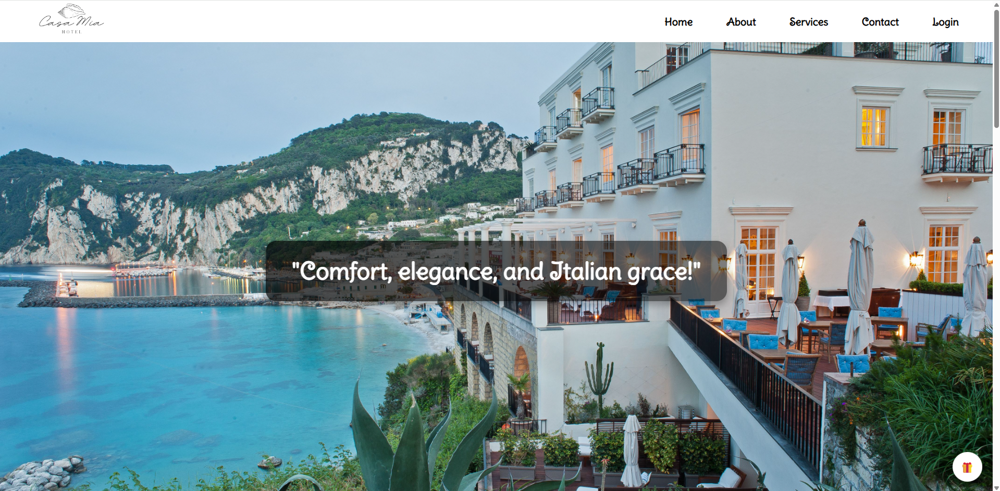
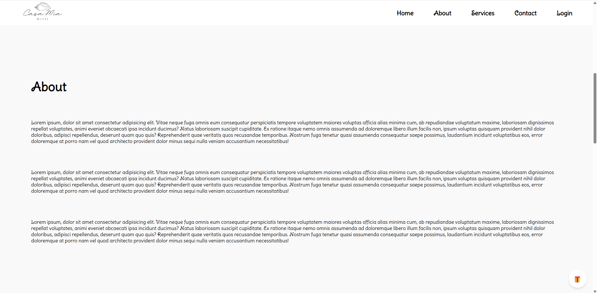
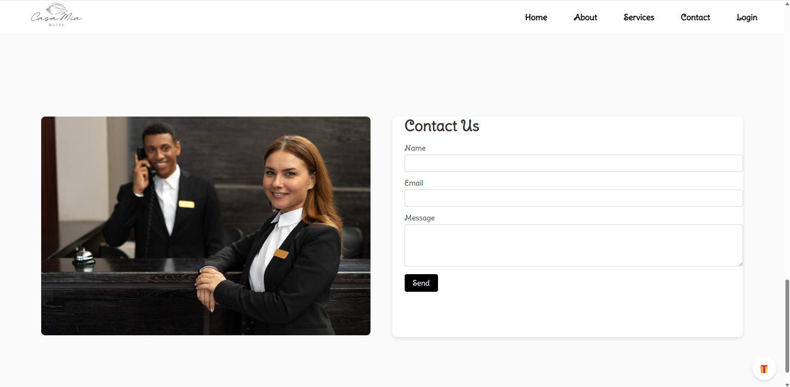
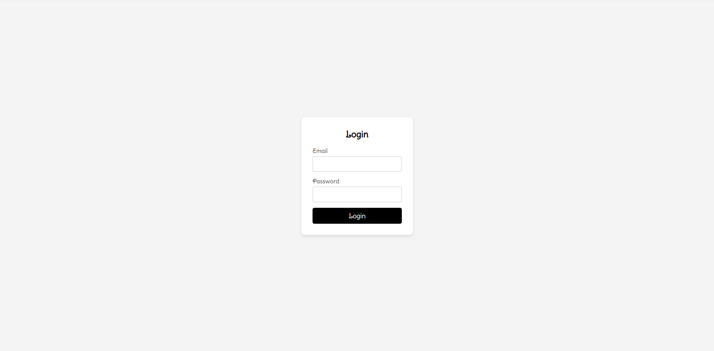

# Casamia Hotel Website

This is a simple and elegant front-end web project designed for a fictional hotel named "Casamia Hotel". The site includes a homepage and a login page, and is built using basic HTML, CSS, and JavaScript.

## 📁 Project Structure

casamia-hotel/
├── index.html
├── login.html
├── style.css
├── script.js
└── images/

## 🌟 Features

- Beautiful homepage layout with images
- Simple login page structure
- Responsive design
- Clean CSS styling and transitions

## 🛠️ Technologies Used

- HTML5
- CSS3
- JavaScript (Vanilla)

## 🖼️ Screenshots

### 🏨 Homepage






### 🔐 Login Page



## 💻 Getting Started

To run the project locally:

1. Clone the repository:
   ```bash
   git clone https://github.com/Kaandalgar/casamia-hotel.git
   ```
2. Open index.html in your browser.
